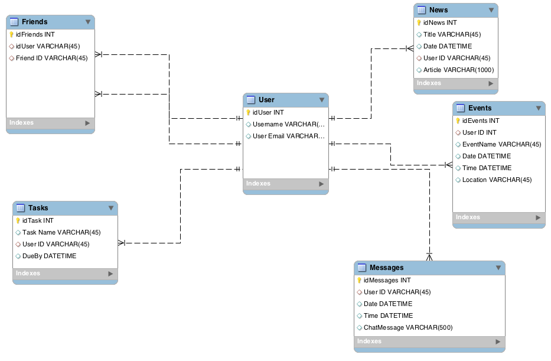

<!-- David Taylor -->

# Nutshell

## What is Nutshell?
It's a dashboard for people to organize their daily tasks, events, news article, friends, and chat messages.

***
***

## How to download and run the application. :computer:

1. Clone the git repository.
```
git clone https://github.com/Ravenous-Rhinos/react-nutshell.git
```
2. Start server.
```
npm start
```

***
***

## Description of the different modules.
***
#### Login :lock:
Register for a profile or login to an existing profile.
***
#### Events :calendar:
Create an event with a title, location, and date.
Events are sorted by nearest date in descending order.
Each event can be edited or deleted. 
***
### Tasks :pushpin:
Create a task with a title, date, and checkbox.
Each task can be edited.
Tasks are removed by checking in the checkbox.
***
#### Articles :page_facing_up:
Post an article with a title, summary, and link.
Articles can be deleted.
Articles are posted with the current date and time.
The date and time are updated when the article is edited.
<!-- *** -->
<!-- #### Friends :busts_in_silhouette:
Search for friends on nutshell by username and add them to your friends list.
After you add a friend, you can delete them from your friends list. -->
***
#### Chat :speech_balloon:
A group chat that allows you to talk with all you friends.

***
***
## ERD

